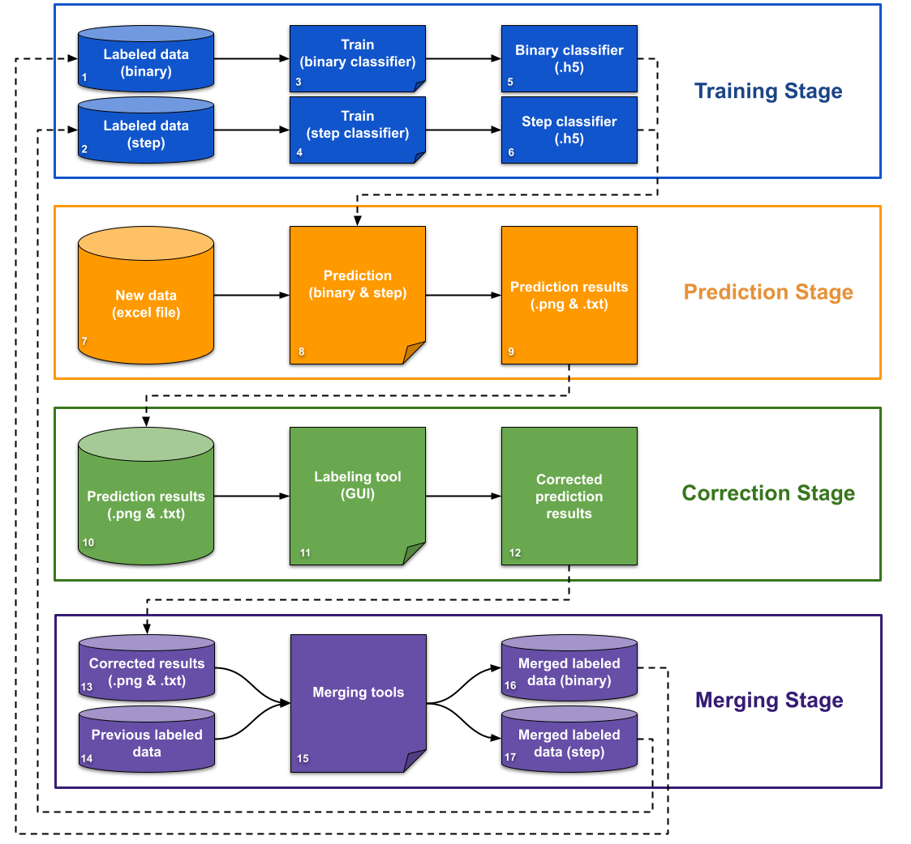
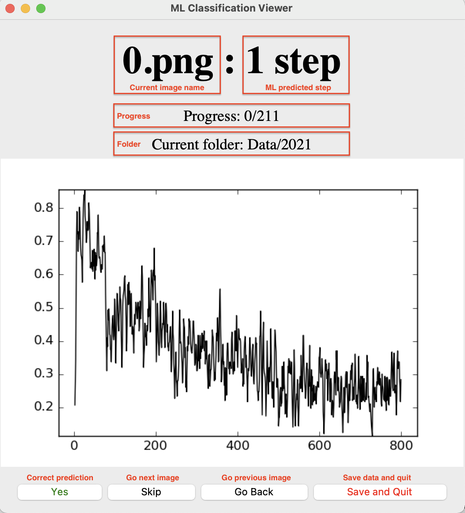

# Project Overview

In this project, we will develop a machine learning processing pipeline that can train and classify the single-molecule fluorescence data generated from an electron multiplying charge coupled devices (EMCCD). Each dataset consists of thousands of image files where each frame represents a snapshot of single fluorescent molecules. The signature of the signal changes over time and is representative of the oligomerization state of the molecule, and chemistry experts manually classify each signature of the signal into different categories which take a tremendous amount of time.

We will develop a machine learning based data analysis platform that uses Microsoft's cloud-based system for single molecule studies of in vivo protein oligomerization. We will utilize a convolutional neural network (CNN) with multilayer classification and other machine learning techniques to develop a rapid and accurate data analysis platform.

As we collect dataset, a local machine will pre-process the captured images and data to prepare clean dataset with pre-fixed parameters. It will transfer the pre-processed data to the Microsoft VM with our custom machine learning code. We are planning to use docker images such as the NVIDIA GPU cloud (NGC) for training and classifying procedures to get GPU supports. Alternatively, we may build custom images of Azure VM that contains all required artifacts to run our machine learning pipeline. After we train a solid machine learning model, we will make a script that researchers can execute using Azure CLI to automatically classify newly collected data which will significantly reduce the time and effort that was needed to process the data manually previously.

---

<br/><br/>

# 0 - Setting up Python Environment

Repo address: https://github.com/ywsong2/uky-chem-ml

## Clone git repo

```bash
git clone https://github.com/ywsong2/uky-chem-ml.git
```

If you added SSH key on the Gitlab, then use below.

```bash
git clone git@github.com:ywsong2/uky-chem-ml.git
```

## 0.1 Download and Install Anaconda

Download and install Anaconda based on your OS. (<https://docs.anaconda.com/free/anaconda/install/index.html>)

## 0.2 Create a conda environment with Tensorflow (CPU) using terminal (or Anaconda Prompt for Windows)

Create a Conda enviroment

For CPU:

```bash
conda create -n tfcpu python=3.10 tensorflow pandas matplotlib scikit-learn scipy pillow xlrd nb_conda ipykernel openpyxl keras
```

For GPU:

```bash
conda create -n tfgpu python=3.10 tensorflow-gpu pandas matplotlib scikit-learn scipy pillow xlrd nb_conda ipykernel openpyxl keras
```

## 0.3 Activate created environment

For CPU,

```bash
conda activate tfcpu
```

For GPU,

```bash
conda activate tfgpu
```

## 0.4 Check if the Tensorflow is correctly installed

```bash
(tfcpu) $ python
Python 3.6.8 |Anaconda, Inc.| (default, Dec 29 2018, 19:04:46)
[GCC 4.2.1 Compatible Clang 4.0.1 (tags/RELEASE_401/final)] on darwin
Type "help", "copyright", "credits" or "license" for more information.
>>> import tensorflow as tf
>>> tf.__version__
'1.13.1'
>>>
```

<br/><br/>

---

# 1 - Overall flowchart

The flowchart below shows the overall process using 2 machine learning (2ML) layered approach. There are 4 stages composed by **`training`**, **`prediction`**, **`correction`**, and **`merging stage`**.

- `Training stage`: Training the new binary and step classifier from labeled data. This stage requires two input data. One for binary and the other for step classifier. The output of this stage is two trained classifiers from machine learning (.h5 files).

- `Prediction stage`: Prediction stage predicts the new data (Excel files) using previously trained classifiers in the `training stage`. The predicted results are generated by name of the input file and it contains .png and .txt files.

- `Correction stage`: Correction stage is correcting the prediction errors that occured during `prediction stage` by ML models. This requires expert's involvement. An expert can run labeling tool (GUI) software to correct prediction errors.

- `Merging stage`: Merging stage merges the corrected data with previous labeled training data to increase the size of training data for next `training stage`.



---

<br/><br/>

# 2 - Training Stage

The training stage takes the labeled input data and create the classifier for the model. For 2ML layer training, two different trainings are required to create a binary classifier and step classifier.

## 2.1 Input arguments for training

| Arguments |    Descriptions     | Type  |  Default value  |
| :-------: | :-----------------: | :---: | :-------------: |
|    -h     |      Show help      |       |                 |
|    -e     |   Number of EPOCH   |  int  |       30        |
|    -b     |     Batch size      |  int  |       100       |
|    -d     | Input data filename |  str  | MyLabelData.txt |
|    -l     |    Learning rate    | float |     0.0001      |

## 2.2 Training binary classifer

This will create a trained classifier that has following name convention: `BINARY_CLASSIFIER_[training mode]_[current time]_[training data size].h5`

```bash
python 1D_CNN_Binary.py -e 20 -d BINARY_TWSD_20190520_135333.txt
```

## 2.3 Training step classifer

This will create a trained classifier that has following name convention: `STEP_CLASSIFIER_[training mode]_[current time]_[training data size].h5`

```bash
python 1D_CNN_Steps.py -e 20 -d STEPS_TWSD_20190520_135333.txt
```

## 2.4 Example for single layer ML training **(outdated)**

> The single ML layered prediction (and training) was initially used for the project. We may use 2ML layered training mostly but just for completeness, we put information about single ML layer training.

```bash
python 1D_CNN_Train.py -e 20 -d MyLabelData.txt
```

## 2.5 Training data structure

---

<br/><br/>

# 3 - Prediction Stage

## 3.1 2ML Layered prediction

The 2 machine learning (ML) layered prediction uses two trained ML classifiers to predict 0 or non-zero step with the first classifier, the binary classifier, and then predict 1, 2, or 3 step from non-zero data from first prediction with the second classifier (step classifier).
To perform 2ML layered predictions, you need to have two trained ML classifiers (.h5).
For binary classifier, the trained model name usually starts with `BINARY_CLASSIFIER_*`. For step classifier, the trained model name usually starts with `STEP_CLASSIFIER_*`.

## 3.2 Prediction input arguments

| Arguments |                             Descriptions                             | Type |
| :-------: | :------------------------------------------------------------------: | :--: |
|    -h     |                              Show help                               |      |
|    -p     |                           Prediction flag                            | bool |
|    -mb    |                Binary classifier model (.h5) filename                | str  |
|    -ms    |                 Step classifier model (.h5) filename                 | str  |
|    -i     |                           Input excel file                           | str  |
|    -f     |                     Target folder for data files                     | str  |
|    -a     | If -a is set with -p, it will process all files in the target folder |      |

---

## 3.3 Example prediciton commands

Example below shows how to predict all excel files under `Data/2021/` folder.

```bash
python 1D_CNN_2L_Prediction.py -f Data/2021/ -mb BINARY_CLASSIFIER_1DCNN_20190611_202715_67660.h5 -ms STEP_CLASSIFIER_1DCNN_20190521_155002_49281.h5 -p -a
```

Example below shows how to predict single excel file. `-i` flag is used insted of `-f` and `-a`.

```bash
python 1D_CNN_2L_Prediction.py -i Data/2021/nicotine\ cortex\ 1800\ gain\ 100ms\ 3mW\ tirf\ 1.xlsx -mb BINARY_CLASSIFIER_1DCNN_20190611_202715_67660.h5 -ms STEP_CLASSIFIER_1DCNN_20190521_155002_49281.h5 -p
```

## 3.4 Single ML layer prediction **(outdated)**

> The single ML layered prediction (and training) was initially used for the project. We may use 2ML layered predictions mostly but just for completeness, we put information about single ML layer prediction.

### Single ML prediction example (single Excel file)

```bash
python 1D_CNN_Train.py -i test.xlsx -m 20190308_092346_1DCNN_numofepoch\(20\)_batchsize\(100\)_lr\(0.0001\).h5 -p
```

### Prediction example (all Excel files in the target folder)

This example shows how to predict all Excel files in the target folder. You have to add -a flag with -f argument. The -f option specifies the target folder.

```bash
python 1D_CNN_Train.py -m 20190429_150721_41870.h5 -f Data/high\ concentration/saline/striatum -p -a
```

## 3.5 Predicted data structure

`1D_CNN_2L_Prediction.py` will create folders and files with parenthesis in the tree below. Ones with parenthesis (e.g. 0M, 1M, 2M, 3M, and Result.csv) will be created by `GUI.py` which is next stage (`correction stage`).

```
{input excel file name}
|
└─── 0
└─── 1
└─── 2
└─── 3
└─── (0M)
└─── (1M)
└─── (2M)
└─── (3M)
└─── MultiWinSize
│       └─── 1
│       └─── 2
│       └─── 3
│       └─── 4
│       └─── 5
│
└─── Data.txt
└─── (Result.csv)
```

---

<br/><br/>

# 4 - Correction Stage

The correction stage is correcting prediction errors from ML predicted results using a graphical user interface (GUI) too. The chemistry experts need to involve this procedure to correct errors.

## 4.1 Input arguments for correction GUI tool

| Arguments |    Descriptions    | Type | Default value |
| :-------: | :----------------: | :--: | :-----------: |
|    -h     |     Show help      |      |               |
|    -i     |    Input folder    | str  |               |
|    -s     | Step(s) to correct | str  |               |

## 4.2 Example of running `GUI.py` tool

```
python GUI.py -i Data/2021/nicotine\ cortex\ 1800\ gain\ 100ms\ 3mW\ tirf\ 11
```

Image below shows the screenshot of GUI tool.



## 4.3 Keyboard commands for GUI tool

You can press keys listed below to change predicted steps. `M` behind 0, 1, 2, and 3 (e.g. 0M, 1M, 2M, 3M) stands for `Maybe`. These data will be considered as not valid data to merge into training data because it is too ambiguous to make clear decision. You can change the moving window size to show different image representation using left and right arrow keys.

|    Key Press     |         Descriptions         |
| :--------------: | :--------------------------: |
|        0         | Set current image to 0 step  |
|        1         | Set current image to 1 step  |
|        2         | Set current image to 2 step  |
|        3         | Set current image to 3 step  |
|        !         | Set current image to 0M step |
|        @         | Set current image to 1M step |
|        #         | Set current image to 2M step |
|        $         | Set current image to 3M step |
| Left Arrow (⬅️)  |  Reduce moving window size   |
| Right Arrow (➡️) |  Reduce moving window size   |

After all correction is done for the target folder, the `GUI.py` will create `Result.csv` file that shows result of correct stage at the target folder. This `Result.csv` is going to be used for the following steps. Do not change or modify the file.
<br/><br/>

# 5 - Merging Stage

After all corrections are done for the scanned data, we can merge the correctly label data into the preivous training dataset. By doing so, we are increasing the labeled training data and it will eventually increase the overall accuracy of 2ML models.

## 5.1 How to merge all `Result.csv` files into single `Summary.csv`

This step combines all `Result.csv` files that are generated during the `correction stage` for each scan folder into `Summary.csv` file. Each `Result.csv` file contains the prediction and correction result for each scan folder. After merging all `Result.csv` files into single `Summary.csv` file, the `Summary.csv` file shows the ML prediction accuarcy.

### Input arguments for ResultMerger.py

The table below shows the input arguments for ResultMerger.py

| Arguments |     Descriptions     | Type | Default value |
| :-------: | :------------------: | :--: | :-----------: |
|    -h     |      Show help       |      |               |
|    -i     |  Input folder name   | str  |               |
|    -o     | Output csv file name | str  |  Summary.csv  |
|    -v     |      Debug mode      |      |     False     |

### Command example for ResultMerger.py

```bash
(base) $ python ResultMerger.py -i ../cerebellum/
-- Configuration --
Debug mode = False
Input folder = ../cerebellum/
Output filename = ../cerebellum//Summary.csv
```

### Eaxmple of Summary.CSV

> **TNI**: Total Number of Images,**CP**: Correct Predictions, **OACC**: Overall Accuracy

|                                                                                           |      |     |     |     |     |     |     |     |      |      |         |
| ----------------------------------------------------------------------------------------- | ---- | --- | --- | --- | --- | --- | --- | --- | ---- | ---- | ------- |
| DIR_NAME                                                                                  | 0    | 1   | 2   | 3   | 0M  | 1M  | 2M  | 3M  | TNI  | CP   | OACC    |
| ../cerebellum/cerebellum nicotine varenicline alpha4 gfp 1800gain 100ms tirf3/Result.csv  | 62   | 13  | 8   | 4   | 0   | 5   | 6   | 1   | 87   | 51   | 58.6207 |
| ../cerebellum/cerebellum nicotine varenicline alpha4 gfp 1800gain 100ms tirf4/Result.csv  | 84   | 17  | 8   | 1   | 0   | 6   | 5   | 0   | 110  | 82   | 74.5455 |
| ../cerebellum/cerebellum nicotine varenicline alpha4 gfp 1800gain 100ms tirf5/Result.csv  | 112  | 0   | 11  | 0   | 0   | 0   | 10  | 1   | 123  | 105  | 85.3659 |
| ../cerebellum/cerebellum nicotine varenicline alpha4 gfp 1800gain 100ms tirf2/Result.csv  | 82   | 10  | 8   | 3   | 0   | 3   | 3   | 2   | 103  | 75   | 72.8155 |
| ../cerebellum/cerebellum nicotine varenicline alpha4 gfp 1800gain 100ms tirf13/Result.csv | 115  | 14  | 15  | 9   | 0   | 3   | 3   | 1   | 153  | 93   | 60.7843 |
| ../cerebellum/cerebellum nicotine varenicline alpha4 gfp 1800gain 100ms tirf14/Result.csv | 164  | 8   | 12  | 4   | 0   | 1   | 5   | 1   | 188  | 128  | 68.0851 |
| ../cerebellum/cerebellum nicotine varenicline alpha4 gfp 1800gain 100ms tirf15/Result.csv | 136  | 16  | 14  | 2   | 0   | 3   | 8   | 2   | 168  | 99   | 58.9286 |
| ../cerebellum/cerebellum nicotine varenicline alpha4 gfp 1800gain 100ms tirf12/Result.csv | 118  | 6   | 7   | 0   | 0   | 3   | 5   | 1   | 131  | 71   | 54.1985 |
| ../cerebellum/cerebellum nicotine varenicline alpha4 gfp 1800gain 100ms tirf9/Result.csv  | 115  | 15  | 13  | 0   | 0   | 3   | 5   | 3   | 143  | 91   | 63.6364 |
| ../cerebellum/cerebellum nicotine varenicline alpha4 gfp 1800gain 100ms tirf7/Result.csv  | 82   | 10  | 8   | 4   | 0   | 5   | 3   | 1   | 104  | 69   | 66.3462 |
| ../cerebellum/cerebellum nicotine varenicline alpha4 gfp 1800gain 100ms tirf1/Result.csv  | 101  | 16  | 13  | 3   | 0   | 6   | 5   | 0   | 133  | 82   | 61.6541 |
| ../cerebellum/cerebellum nicotine varenicline alpha4 gfp 1800gain 100ms tirf6/Result.csv  | 56   | 4   | 8   | 2   | 0   | 1   | 3   | 0   | 70   | 44   | 62.8571 |
| ../cerebellum/cerebellum nicotine varenicline alpha4 gfp 1800gain 100ms tirf8/Result.csv  | 158  | 0   | 0   | 0   | 0   | 0   | 0   | 0   | 158  | 158  | 100     |
| ../cerebellum/cerebellum nicotine varenicline alpha4 gfp 1800gain 100ms tirf10/Result.csv | 207  | 26  | 9   | 4   | 0   | 9   | 10  | 0   | 246  | 107  | 43.4959 |
| ../cerebellum/cerebellum nicotine varenicline alpha4 gfp 1800gain 100ms tirf11/Result.csv | 151  | 21  | 16  | 6   | 0   | 4   | 5   | 0   | 194  | 129  | 66.4948 |
| ../cerebellum/cerebellum nicotine varenicline alpha4 gfp 1800gain 100ms tirf16/Result.csv | 142  | 16  | 10  | 3   | 0   | 4   | 6   | 0   | 171  | 129  | 75.4386 |
| Summary                                                                                   | 1885 | 192 | 160 | 45  | 0   | 56  | 82  | 13  | 2282 | 1513 | 66.3015 |

## 5.2 Merge all `Data.txt` files into single `MergedData.txt` file

The `Data.txt` file under each scan folder contains the raw data of scans. These files need to be merged into single file which is `MergedData.txt` file to group them all together. This step is required to perfer next step.

### Input arguments for DataMerger.py

| Arguments |     Descriptions      | Type | Default value  |
| :-------: | :-------------------: | :--: | :------------: |
|    -h     |       Show help       |      |                |
|    -i     |   Input folder name   | str  |                |
|    -o     | Output data file name | str  | MergedData.txt |
|    -v     |      Debug mode       |      |     False      |

### Command example for DataMerger.py

Example command below shows merging all `../cerebellum/*/Data.txt` files into `../cerebellum/MergedData.txt`.

```bash
(base) $ python DataMerger.py -i ../cerebellum/ -o MergedData.txt
-- Configuration --
Debug mode = False
Input folder = ../cerebellum/
Output filename = ../cerebellum//MergedData.txt
Processing on - ../cerebellum/cerebellum nicotine varenicline alpha4 gfp 1800gain 100ms tirf3/Data.txt
Processing on - ../cerebellum/cerebellum nicotine varenicline alpha4 gfp 1800gain 100ms tirf4/Data.txt
Processing on - ../cerebellum/cerebellum nicotine varenicline alpha4 gfp 1800gain 100ms tirf5/Data.txt
Processing on - ../cerebellum/cerebellum nicotine varenicline alpha4 gfp 1800gain 100ms tirf2/Data.txt
Processing on - ../cerebellum/cerebellum nicotine varenicline alpha4 gfp 1800gain 100ms tirf13/Data.txt
Processing on - ../cerebellum/cerebellum nicotine varenicline alpha4 gfp 1800gain 100ms tirf14/Data.txt
Processing on - ../cerebellum/cerebellum nicotine varenicline alpha4 gfp 1800gain 100ms tirf15/Data.txt
Processing on - ../cerebellum/cerebellum nicotine varenicline alpha4 gfp 1800gain 100ms tirf12/Data.txt
Processing on - ../cerebellum/cerebellum nicotine varenicline alpha4 gfp 1800gain 100ms tirf9/Data.txt
Processing on - ../cerebellum/cerebellum nicotine varenicline alpha4 gfp 1800gain 100ms tirf7/Data.txt
Processing on - ../cerebellum/cerebellum nicotine varenicline alpha4 gfp 1800gain 100ms tirf1/Data.txt
Processing on - ../cerebellum/cerebellum nicotine varenicline alpha4 gfp 1800gain 100ms tirf6/Data.txt
Processing on - ../cerebellum/cerebellum nicotine varenicline alpha4 gfp 1800gain 100ms tirf8/Data.txt
Processing on - ../cerebellum/cerebellum nicotine varenicline alpha4 gfp 1800gain 100ms tirf10/Data.txt
Processing on - ../cerebellum/cerebellum nicotine varenicline alpha4 gfp 1800gain 100ms tirf11/Data.txt
Processing on - ../cerebellum/cerebellum nicotine varenicline alpha4 gfp 1800gain 100ms tirf16/Data.txt
Total number of merged data files= 16
Total number of merged data = 2266
(base) $
```

## 5.3 Creating the synthetic data

Before merging data into training dataset, we may need to create synthetic data to avoid 0 setp bias in the dataset.

### Input arguments for Synthesize.py

| Arguments |        Descriptions        | Type | Default value |
| :-------: | :------------------------: | :--: | :-----------: |
|    -h     |         Show help          |      |               |
|    -n     | Number of images to create | int  |     1000      |

### Command example for Synthesize.py

Command belows creates 22500 (7500 for 1, 2, and 3 steps) synthesized datasets.

> The create file will have `YYYYMMDD_HHMMSS_syn_data.txt` format (e.g. `20210811_150318_syn_data.txt`).

```bash
$ python Synthesize.py -n 7500
-- Configuration --
Number of images to synthesize = 7500
Current counter = 3000 /22500
Current counter = 6000 /22500
Current counter = 9000 /22500
Current counter = 12000 /22500
Current counter = 15000 /22500
Current counter = 18000 /22500
Current counter = 21000 /22500
```

## 5.4 Merging all data

Now, you can merge all data files into single file. User needs to manually edit MergeTrainingData.py file to specify which files that they want to merge. Users can update `list_of_data` array in the MergeTrainingData.py file to add more dataset.

The command example below shows how to merge all dataset (newly corrected data and synthesized data)

> This command will create a file that has `TWSD_YYYYMMDD_HHMMSS.txt` naming convention (e.g. `TWSD_20210811_150318.txt`).

```bash
$ python MergeTrainingData.py
```

## 5.5 Split binary and step training data from merged data (for 2ML)

After merging all data into one file (with correct label), you can run this command to split them out into two different files. One file will start with `BINARY_` that contains all training data with 0 or 1 label. Another file will be createdw with `STEPS_` that contains all training data with 1, 2, or 3 label. Those two different files can be used for training 2 layered ML models.

### Input argument for SplitTrainingData.py

| Arguments | Descriptions  | Type |  Default value  |
| :-------: | :-----------: | :--: | :-------------: |
|    -h     |   Show help   |      |                 |
|    -d     | Data filename | str  | MyLabelData.txt |

### Command example for SplitTrainingData.py

> This command will create `BINARY_TWSD_20190510_140856.txt` and `STEP_TWSD_20190510_140856.txt`.

```bash
$ python SplitTrainingData.py -d TWSD_20190510_140856.txt
```

# Reference

Results of predictions

> https://docs.google.com/spreadsheets/d/1D7YPc5JOYatVD83BaK5mRgsWw8S1rOHwZbeo4YFX3n4/edit#gid=0
